# Play2Chill zadanie testowe - prosta rozgrywka multiplayer
Do realizacji zadania stworzyłem prostą grę multiplayer, maksymalnie dla czterech graczy, minimum dla dwóch.
 Na początku gry, graczom wyświetla się menu startowe (server browser), w którym można utworzyć serwer lub dołączyć do już istniejącego.
Następnie należy zaznaczyć gotowość - jeśli wszyscy gracze będą gotowi, host może zacząć rozgrywkę. Score jest to ilość zadanych obrażeń,
 ale wygrywa ostatni gracz będący przy życiu. Możliwe jest uleczenie się apteczką. Po zakończeniu rozgrywki pokazywany jest ekran z punktacją oraz przyciski
"Leave Session" dla graczy i host oraz "New Match" tylko dla hosta. Naciśnięcie "New Match" przenosi wszystkich graczy do początkowego lobby.

## Instrukcja uruchomienia
### Wymagania
- **Unreal Engine 5.8**
- **Visual studio 2022 z komponentem "Game development with C++"**
- **Git LFS** - instalacja to po prostu `git lfs install`

### Uruchomienie
- `git clone https://github.com/Gazda-dev/MPTestTask.git`
- Prawym na .uproject -> generate Visual Studio project files
- Wybierz liczbę graczy 2-4, zaznacz NetMode -> Play As Standalone, Standalone Game

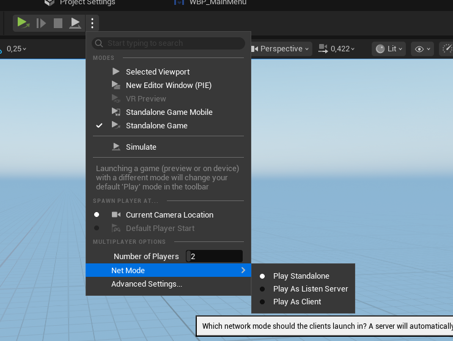

Klasyczne sterowanie WSAD, LPM - strzał, E - interakcja (do podnoszenia apteczki)

### Przepływ gry
- Server browser -> host tworzy serwer i automatycznie na niego dołącza
- gracz/gracze naciskają "Find servers" i dołączają na wybrany serwer
- w lobby wszyscy muszą nacisnąć że są gotowi, host wtedy może wystartować rozgrywkę
- gracze próbują się zastrzelić, mogą się leczyć, wygrywa ostatni przy życiu
- na koniec wyświetla się podsumowanie rozgrywki, wskazanie zwycięzcy oraz punktacja (damage)
- jeśli host naciśnie przycisk nowy mecz, lobby zostaje utworzone od nowa - znowu gracze muszą być gotowi

## Opis rozwiązania
**Wszystkie klasy powinny być implementowane w C++ z opcjami konfiguracyjnymi i efektami wizualnymi dodawanymi w Blueprintach - zrealizowane**

- Serwer jest jedynym źródłem prawdy, klient prosi - serwer rozstrzyga i zwraca wynik replikacją. Klient nigdy sam nie zmienia stanu gry
- Zdrowie zostało zaimplementowane generycznym HealthComponent
- Strzał jest realizowany na własnym kanale kolizji "Weapon". Klient wysyła chęć strzału i celownik - serwer waliduje i robi własny trace oraz nakłada damage.
Efekty odpalane są w c++ ale ich setup jest w edytorze. Efekty lecą przez unreliable multicast - optymalizacja (jak pakiet zniknie to nic poważnego się nie stanie)
- Interakcja - wykrywanie po stronie klienta na timerze z opcjonalnym zmieniem czasu wykrywania (nie tick - optymalizacja) - walidacja i wykonanie po stronie serwera, dodatkowe zabezpieczenie przy podnoszeniu
PickableItem (np. apteczka) aby dwóch graczy nie mogło podnieść tej samej "w tym samym momencie"
- Przepływ meczu jest realizowany poprzez maszynę stanów w GameState (WaitingForPlayers/InProgress/PostMatch). Sędzią rozstrzygającym i sterującym rozgrywką jest GameMode
- Statystyki są poprawnie przekazywane między stanami rozgrywki z użyciem PlayerState (np. DamageDealt)
- Sesje są zaimplementowane z użyciem MPTestTaskSessionSubsystem i IOnlineSubsystem - host/szukanie/dołączanie/opuszczanie rozgrywki
- Pathy map i niektóre konfigurowalne properties są realizowane z użyciem DevSettings (łatwa konfiguracja w ProjectSettings, brak raw stringów tylko wzięcie pathu z TSoftObjectPtr)

 

### EOS
Została zaimplementowana i przetestowana integracja EOS. Nie znalazłem sposobu na pełne przetestowanie na dwóch
graczach (z tego co wyczytałem wymagane drugie konto EPIC) ale same logowanie i zhostowanie gry przez użytkownika Epic działa
(na drugim kliencie serwer był wyszukiwany ale padał przy próbie dołączenia).

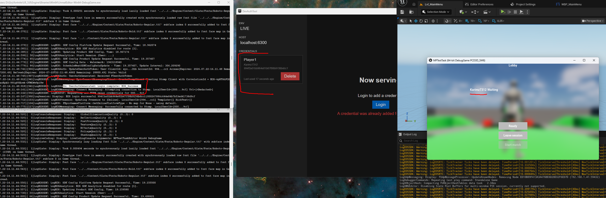

Domyślnie projekt ustawiony jest na LAN ale możliwe jest włączenie EOS poprzez bool w ProjectSettings-MPTestTaskSettings-bUseEOS oraz
odkomentowanie kilku linii w DefaultEngine (369-372 oraz DefaultPlatformService ustawić na "EOS"). 
Dodatkowo należy użyć własnych danych z portalu Epic oraz użyć EOS sdk.

Jeśli jest włączony EOS przy rozpoczęciu gry odpala się dodatkowy przycisk "Login", który waliduje informacje z Epic'a i loguje gracza.

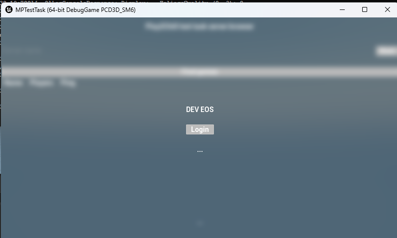

 

### Struktura projektu
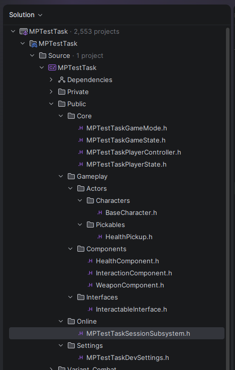

## Optymalizacja

### Zaimplementowanie prostych mechanizmów redukcji ruchu sieciowego
- zrealizowane z użyciem
 - - NetUpdateFrequency 100Hz -> 30Hz na postaci
 - - MinNetUpdateFrequency - 20Hz + net.UseAdaptiveNetUpdateFrequency=1 - gdy postac się nie rusza
serwer sam schodzi do 20Hz i podbija do 30Hz gdy postać się rusza
 - - dodatkowo MaxHealth jako niereplikowane, kosmetyka wystrzału Unreliable multicast, wynik liczony serwerowo
i wysyłany jako gotowa liczba, a nie każde trafienie osobno, klient nie strzela szybciej aniżeli konfigurowalny fireRate

#### Wyniki
wyniki zostały zmierzone dzięki Unreal Insights - podobny zakres czasu oraz zachowanie graczy

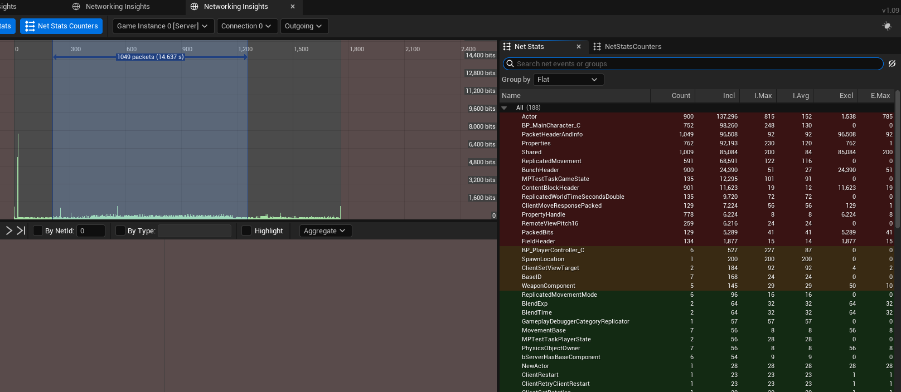
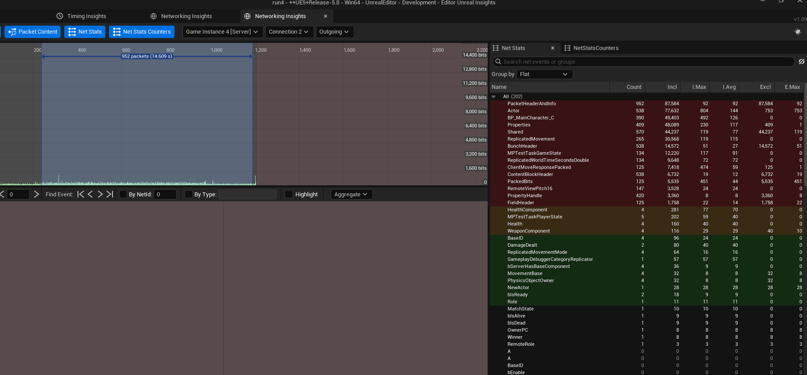

| Insigths                      | Przed (100 Hz) | Po (30 Hz + adaptive) | Zmiana |
|-------------------------------|----------------|-----------------------|--------|
| `BP_MainCharacter_C`          | 98 260 b       | 49 403 b              |**−50%**|
|  z czego `ReplicatedMovement` | 68 591 b       | 30 568 b              |**−55%**|

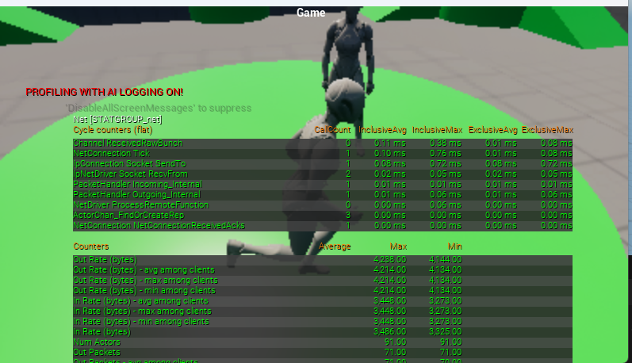
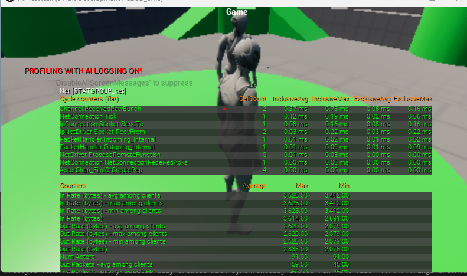

| stat net   | Przed     | Po       | Zmiana   |
|------------|-----------|----------|----------|
| OutRate    | ~4238 B/s | 2333 B/s | **−45%** |
| OutPackets | ~71/s     | ~59/s    | **−17%** |

 

### Zaimplementowanie podstawowych elementów optymalizacji animacji i zarządzania tickiem aktorów w przynajmniej jednej klasie
- zrealizowane z użyciem
- - `GetMesh()->VisibilityBasedAnimTickOption = EVisibilityBasedAnimTickOption::OnlyTickPoseWhenRendered;` - animacje postaci
liczone tylko gdy jest renderowana
- - `GetMesh()->bEnableUpdateRateOptimizations = true;` - rzadsza aktualizacja anim dalszych postaci
- - komponenty mają wyłączony tick i działają event/timer-driven 

 

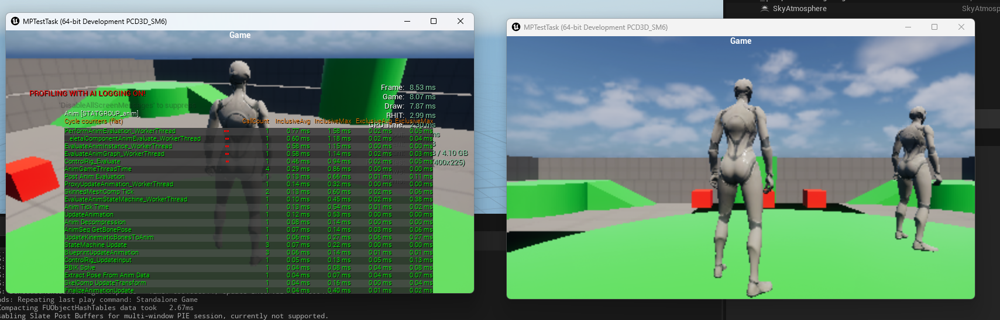
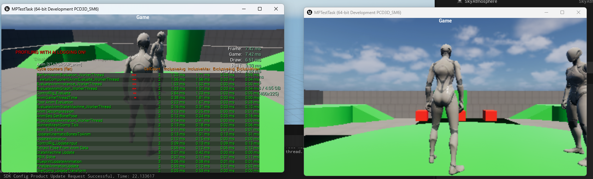
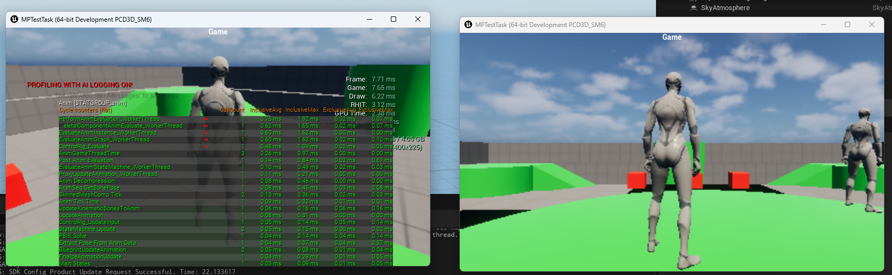

|                                                                | Przed   | Po      | Zmiana      |
|----------------------------------------------------------------|---------|---------|-------------|
| stat unit - Game                                               | ~8 ms   | ~7.6 ms | **−5%**     |
| stat anim - AnimTickTime                                       | 0.13 ms | 0.09 ms | **−0.04ms** |
| stat anim - CallCount AnimGameThreadTime (kadr vs poza kadrem) | 5       | 3       | **−2**      |

 
 

## Architektura

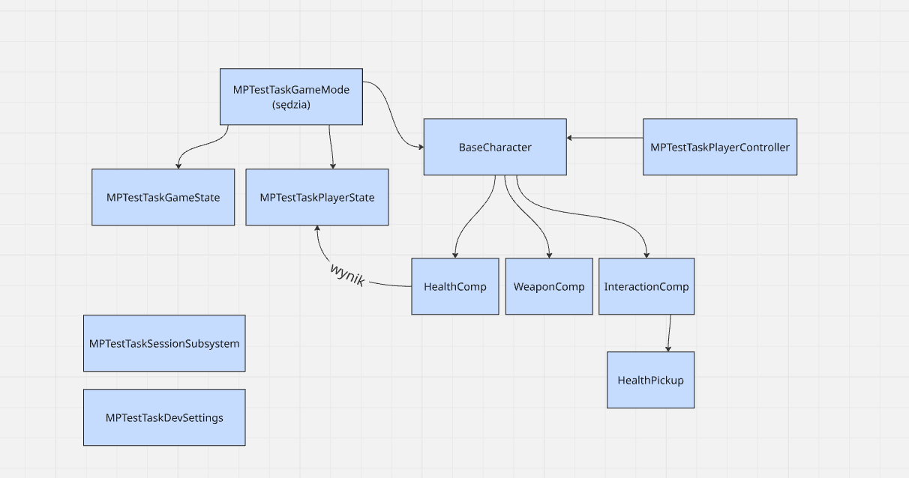

 

### Możliwe rozszerzenia

- na pewno należałoby zająć się gameplay'em - chciałem dodać normalny AimOffset do celowania, broń, animację strzału, hitReact + fxs
lecz z racji na opóźnienie w dostarczeniu pominięte
- production-ready kod powinien mieć wszystkie UPROPERTY i UFUNCTION + params okomentowane ale dla zadania testowego ograniczyłem
je poza takimi, które samemu czułem że potrzebują wyjaśnienia - reszta myślę że jest odpowiednio samo-opisująca

 

**Wszystkie założenia zadania zostały zrealizowane. Projekt został na nowo sklonowany z github i przetestowany.**